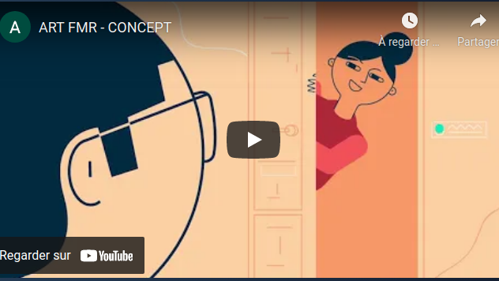

# **🎨 ARTFMR**

[https://artfmr.herokuapp.com/](https://artfmr.herokuapp.com/)

## **🎨 Vous êtes un amoureux de l'art :**

- Découvrez chaque jour de nouvelles oeuvres d'artistes
  venant du monde entier.
- Louez des oeuvres d'artistes et
  rencontrez les à domicile lors de l'accrochage de l'oeuvre
- Prolongez vos locations ou craquez
  immédiatement pour une oeuvre que vous ne voulez plus
  quitter

## **🎨 Vous êtes un artiste :**

- Prenez en main votre activité. Exposez autant d'oeuvres que vous le souhaitez depuis votre page artiste.
- Définissez vos tarifs.
- Exposez vos oeuvres directement chez vos clients. Il se peut que ce soit pour un événement, chez un particulier ou encore au sein d'une entreprise.

## **🎨 Contributeurs :**

- [Melvin REGNAULT](https://github.com/meltek13)
- [Théo CAZENAVE-COUPET](https://github.com/Kelvi3)
- [Boris N'KUAKO](https://github.com/bnthp16)
- [Frederic SEGUIER](https://github.com/fred75013)

## **🎨 Loué soit l'art !**

